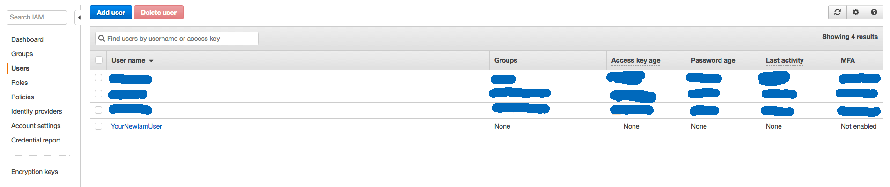

..  _deploy:

Deployment (for Mac & Linux)
============================

Heroku
------

Create a new IAM User for aws
^^^^^^^^^^^^^^^^^^^^^^^^^^^^^

Go on `create new IAM user`_ to create a new IAM User for your S3 Bucket.

At first enter a `User name`` and activate ``Programmatic access`` and than on ``Next: Permission`` button.

.. figure:: _static/img/aws/iam/iam-create-01.png
    :target: _static/img/aws/iam/iam-create-01.png

On the next page ``Set permissions for YourNewIamUser`` just click on ``Next: Review`` without to add any group or policies.


On Review ignore the warning ``This user has no permissions`` and click on ``Create User``.


On the last page write down your new ``Access key ID`` & ``Secret access key`` to use it later on the deployment. And in
the end click on ``Close``


Now get the User ARN, for that click on your new created user.



In the Summary page you will see the user ARN, also write it down for using to setup your S3 Bucket.

.. figure:: _static/img/aws/iam/iam-create-06.png
    :target: _static/img/aws/iam/iam-create-06.png

.. _create new IAM user: https://console.aws.amazon.com/iam/home#/users$new?step=details

.. _SetupAS3Bucket:

Setup a S3 Bucket
^^^^^^^^^^^^^^^^^

To create a S3 Bucket for the media & static files go on `create new S3 Bucket`_ and click on ``+ Create bucket``.


In the following wizard enter your ``Bucket name`` and select your ``Region`` than click on ``Next``.

.. figure:: _static/img/aws/S3/s3-create-02.png
    :target: _static/img/aws/S3/s3-create-02.png

On the next page 'Set properties' just click on ``Next``.

.. figure:: _static/img/aws/S3/s3-create-03.png
    :target: _static/img/aws/S3/s3-create-03.png

And again on 'Set permission' just click on ``Next``.

.. figure:: _static/img/aws/S3/s3-create-04.png
    :target: _static/img/aws/S3/s3-create-04.png

For the last time 'Review' just click on ``Create Bucket``.


So after the Bucket is created click on your new Bucket in the list and  on the right side click on ``Permissions``.


At next click on ``Bucket Policy`` and write down the following policy.

**Importent** change ``BUCKET-NAME`` with your Bucket name and ``USER-ARN`` with your just befor created user.


.. code-block:: json

    {
        "Version": "2008-10-17",
        "Statement": [
            {
                "Sid": "PublicReadForGetBucketObjects",
                "Effect": "Allow",
                "Principal": {
                    "AWS": "*"
                },
                "Action": "s3:GetObject",
                "Resource": "arn:aws:s3:::BUCKET-NAME/*"
            },
            {
                "Effect": "Allow",
                "Principal": {
                    "AWS": "USER-ARN"
                },
                "Action": "s3:*",
                "Resource": [
                    "arn:aws:s3:::BUCKET-NAME",
                    "arn:aws:s3:::BUCKET-NAME/*"
                ]
            }
        ]
    }

Cors Setup

.. code-block:: xml

    <CORSConfiguration>
      <CORSRule>
          <AllowedOrigin>*</AllowedOrigin>
          <AllowedMethod>GET</AllowedMethod>
          <MaxAgeSeconds>3000</MaxAgeSeconds>
          <AllowedHeader>Authorization</AllowedHeader>
      </CORSRule>
    </CORSConfiguration>

Policy & Cors by Wagtail.io: `Wagtail.io Blog - Amazon S3`_


.. _create new S3 Bucket: https://console.aws.amazon.com/s3/home

.. _Wagtail.io Blog - Amazon S3: https://wagtail.io/blog/amazon-s3-for-media-files/

Heroku Deployment
^^^^^^^^^^^^^^^^^

Official Tutorial from Heroku: https://devcenter.heroku.com/articles/deploying-python

Create a Heroku App
"""""""""""""""""""

.. code:: bash

  $ heroku login
  Enter your Heroku credentials.
  ...
  $ heroku create --region eu
  Creating intense-falls-9163... done, stack is cedar
  http://intense-falls-9163.herokuapp.com/ | git@heroku.com:intense-falls-9163.git
  Git remote heroku added
  $ git push heroku master
  ...
  -----> Python app detected
  ...
  -----> Launching... done, v7
         https://intense-falls-9163.herokuapp.com/ deployed to Heroku

Setup Enviroment
""""""""""""""""

Run the ``setup_heroku.sh`` bash script to setup the environment for the heroku instance.

.. code:: bash

  $ ./setup_heroku.sh

Fill the Database & Upload the Static files
"""""""""""""""""""""""""""""""""""""""""""

.. code:: bash

  $ heroku run python manage.py collectstatic --noinput
  $ heroku run python manage.py createsuperuser
  $ heroku run python manage.py oscar_populate_countries

Setup a Domain
""""""""""""""

https://devcenter.heroku.com/articles/custom-domains

Show if anything work's fine
""""""""""""""""""""""""""""

.. code:: bash

  $ heroku info

Continuous Deployment
"""""""""""""""""""""

To enable Continuous Deployment on Bitbucket.com enable Piples in your Bitbucket project & set the enviarables
```HEROKU_APP_NAME``` & ```HEROKU_API_KEY```

More details: https://bitbucket.org/spittet/heroku-deploy

Push Updates (CLI)
^^^^^^^^^^^^^^^^^^

This is only if you want to push updates via the CLI

.. code:: bash

  $ git add -A
  $ git commit -m "your update"
  $ git commit -m "your update"
  $ heroku run python manage.py collectstatic --noinput
  $ heroku run python manage.py migrate
  $ heroku run python manage.py createsuperuser

